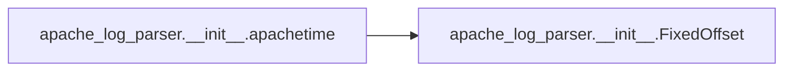
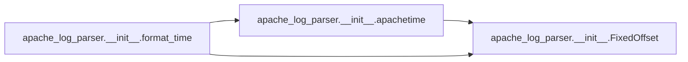
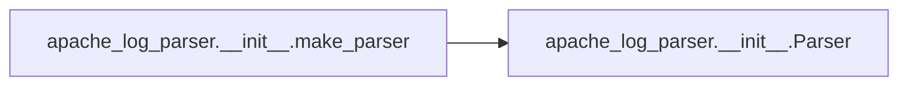
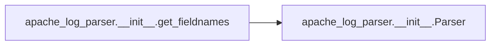

# Apache Log Parser Init

[_Documentation generated by Documatic_](https://www.documatic.com)

<!---Documatic-section-Codebase Structure-start--->
## Codebase Structure

<!---Documatic-block-system_architecture-start--->
```mermaid
None
```
<!---Documatic-block-system_architecture-end--->

# #
<!---Documatic-section-Codebase Structure-end--->

<!---Documatic-section-apache_log_parser.__init__.extract_inner_value-start--->
## apache_log_parser.__init__.extract_inner_value

<!---Documatic-section-extract_inner_value-start--->
<!---Documatic-block-apache_log_parser.__init__.extract_inner_value-start--->
<details>
	<summary><code>apache_log_parser.__init__.extract_inner_value</code> code snippet</summary>

```python
def extract_inner_value(output_prefix, input_suffix):
    regex = re.compile('^%\\{([^\\}]+?)\\}' + input_suffix + '$')

    def matcher(matched_string):
        match = regex.match(matched_string)
        inner_value = match.groups()[0]
        inner_value = inner_value.strip().lower().replace('-', '_')
        return output_prefix + inner_value
    return matcher
```
</details>
<!---Documatic-block-apache_log_parser.__init__.extract_inner_value-end--->
<!---Documatic-section-extract_inner_value-end--->

# #
<!---Documatic-section-apache_log_parser.__init__.extract_inner_value-end--->

<!---Documatic-section-apache_log_parser.__init__.make_regex-start--->
## apache_log_parser.__init__.make_regex

<!---Documatic-section-make_regex-start--->
<!---Documatic-block-apache_log_parser.__init__.make_regex-start--->
<details>
	<summary><code>apache_log_parser.__init__.make_regex</code> code snippet</summary>

```python
def make_regex(format_template):
    (percent, rest) = (format_template[0], format_template[1:])
    return percent + '[<>]?' + rest
```
</details>
<!---Documatic-block-apache_log_parser.__init__.make_regex-end--->
<!---Documatic-section-make_regex-end--->

# #
<!---Documatic-section-apache_log_parser.__init__.make_regex-end--->

<!---Documatic-section-apache_log_parser.__init__.extra_request_from_first_line-start--->
## apache_log_parser.__init__.extra_request_from_first_line

<!---Documatic-section-extra_request_from_first_line-start--->
<!---Documatic-block-apache_log_parser.__init__.extra_request_from_first_line-start--->
<details>
	<summary><code>apache_log_parser.__init__.extra_request_from_first_line</code> code snippet</summary>

```python
def extra_request_from_first_line(matched_strings):
    first_line = matched_strings['request_first_line']
    match = re.match('^(?P<method>GET|HEAD|POST|OPTIONS|PUT|CONNECT|PATCH|PROPFIND|DELETE)\\s?(?P<url>.{,10000}?)(\\s+HTTP/(?P<http_ver>1.[01]))?$', first_line)
    if match is None:
        results = {'request_first_line': first_line, 'request_method': '', 'request_url': '', 'request_http_ver': ''}
    else:
        results = {'request_first_line': first_line, 'request_method': match.groupdict()['method'], 'request_url': match.groupdict()['url'], 'request_http_ver': match.groupdict()['http_ver']}
    return results
```
</details>
<!---Documatic-block-apache_log_parser.__init__.extra_request_from_first_line-end--->
<!---Documatic-section-extra_request_from_first_line-end--->

# #
<!---Documatic-section-apache_log_parser.__init__.extra_request_from_first_line-end--->

<!---Documatic-section-apache_log_parser.__init__.parse_user_agent-start--->
## apache_log_parser.__init__.parse_user_agent

<!---Documatic-section-parse_user_agent-start--->
<!---Documatic-block-apache_log_parser.__init__.parse_user_agent-start--->
<details>
	<summary><code>apache_log_parser.__init__.parse_user_agent</code> code snippet</summary>

```python
def parse_user_agent(matched_strings):
    ua = matched_strings['request_header_user_agent']
    parsed_ua = user_agents.parse(ua)
    matched_strings.update({'request_header_user_agent__browser__family': parsed_ua.browser.family, 'request_header_user_agent__browser__version_string': parsed_ua.browser.version_string, 'request_header_user_agent__os__family': parsed_ua.os.family, 'request_header_user_agent__os__version_string': parsed_ua.os.version_string, 'request_header_user_agent__is_mobile': parsed_ua.is_mobile})
    return matched_strings
```
</details>
<!---Documatic-block-apache_log_parser.__init__.parse_user_agent-end--->
<!---Documatic-section-parse_user_agent-end--->

# #
<!---Documatic-section-apache_log_parser.__init__.parse_user_agent-end--->

<!---Documatic-section-apache_log_parser.__init__.apachetime-start--->
## apache_log_parser.__init__.apachetime

<!---Documatic-section-apachetime-start--->


### Object Calls

* apache_log_parser.__init__.FixedOffset

<!---Documatic-block-apache_log_parser.__init__.apachetime-start--->
<details>
	<summary><code>apache_log_parser.__init__.apachetime</code> code snippet</summary>

```python
def apachetime(s):
    month_map = {'Jan': 1, 'Feb': 2, 'Mar': 3, 'Apr': 4, 'May': 5, 'Jun': 6, 'Jul': 7, 'Aug': 8, 'Sep': 9, 'Oct': 10, 'Nov': 11, 'Dec': 12}
    s = s[1:-1]
    tz_string = s[21:26]
    tz = FixedOffset(tz_string)
    obj = datetime(year=int(s[7:11]), month=month_map[s[3:6]], day=int(s[0:2]), hour=int(s[12:14]), minute=int(s[15:17]), second=int(s[18:20]), tzinfo=tz)
    return obj
```
</details>
<!---Documatic-block-apache_log_parser.__init__.apachetime-end--->
<!---Documatic-section-apachetime-end--->

# #
<!---Documatic-section-apache_log_parser.__init__.apachetime-end--->

<!---Documatic-section-apache_log_parser.__init__.format_time-start--->
## apache_log_parser.__init__.format_time

<!---Documatic-section-format_time-start--->


### Object Calls

* apache_log_parser.__init__.apachetime
* apache_log_parser.__init__.FixedOffset

<!---Documatic-block-apache_log_parser.__init__.format_time-start--->
<details>
	<summary><code>apache_log_parser.__init__.format_time</code> code snippet</summary>

```python
def format_time(matched_strings):
    time_received = matched_strings['time_received']
    obj = apachetime(time_received)
    naive_obj = obj.replace(tzinfo=None)
    utc = FixedOffset('0000')
    utc_obj = obj.astimezone(utc)
    return {'time_received': time_received, 'time_received_datetimeobj': naive_obj, 'time_received_isoformat': naive_obj.isoformat(), 'time_received_tz_datetimeobj': obj, 'time_received_tz_isoformat': obj.isoformat(), 'time_received_utc_datetimeobj': utc_obj, 'time_received_utc_isoformat': utc_obj.isoformat()}
```
</details>
<!---Documatic-block-apache_log_parser.__init__.format_time-end--->
<!---Documatic-section-format_time-end--->

# #
<!---Documatic-section-apache_log_parser.__init__.format_time-end--->

<!---Documatic-section-apache_log_parser.__init__.make_parser-start--->
## apache_log_parser.__init__.make_parser

<!---Documatic-section-make_parser-start--->


### Object Calls

* apache_log_parser.__init__.Parser

<!---Documatic-block-apache_log_parser.__init__.make_parser-start--->
<details>
	<summary><code>apache_log_parser.__init__.make_parser</code> code snippet</summary>

```python
def make_parser(format_string):
    return Parser(format_string).parse
```
</details>
<!---Documatic-block-apache_log_parser.__init__.make_parser-end--->
<!---Documatic-section-make_parser-end--->

# #
<!---Documatic-section-apache_log_parser.__init__.make_parser-end--->

<!---Documatic-section-apache_log_parser.__init__.get_fieldnames-start--->
## apache_log_parser.__init__.get_fieldnames

<!---Documatic-section-get_fieldnames-start--->


### Object Calls

* apache_log_parser.__init__.Parser

<!---Documatic-block-apache_log_parser.__init__.get_fieldnames-start--->
<details>
	<summary><code>apache_log_parser.__init__.get_fieldnames</code> code snippet</summary>

```python
def get_fieldnames(format_string):
    return Parser(format_string).names
```
</details>
<!---Documatic-block-apache_log_parser.__init__.get_fieldnames-end--->
<!---Documatic-section-get_fieldnames-end--->

# #
<!---Documatic-section-apache_log_parser.__init__.get_fieldnames-end--->

[_Documentation generated by Documatic_](https://www.documatic.com)